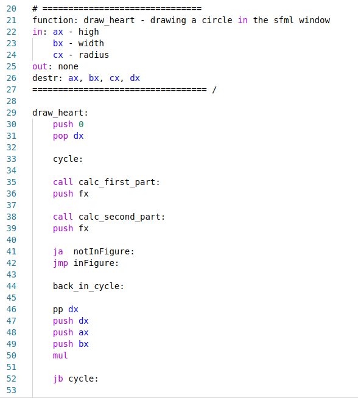
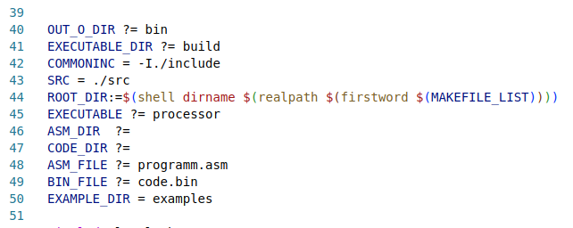

# Processor
В данном проекте реализован простейший виртуальный процессор на языке С с элементами С++. Для данного процессора был реализован собственный ассемблер стандарта DED32.



**Пример кода на виртуальном ассемблере**

## Установка

1. Клонируйте репозиторий:
```bash
git clone https://github.com/Maksim-Sebelev/Processor.git
```
2. Перейдите в папку проекта:
```bash
cd Processor
```

## Компиляция проекта:
Выполните:
```bash
make
```
Будут созданы папки bin и build. Так же будет создан и помещен в папку build исполняемый файл processor.

## Использование
## Без make
1. Создайте рабочий файл с раширением .asm: <your_file_name>.asm
2. Скомпилируйте ваш файл:
```bash
./build/processor -compile <your_asm_file_name>.asm <your_bin_file_name>.bin
```
<your_bin_file_name>.bin - файл куда будет помещен машинный код (файл будет создан автоматически).

3. Запустите бинарник:
```bash
./buid/processor -run <your_bin_file_name>.binсобирается 
```
## С помощью make
Также имеется возможность работать с проектом с помощью предложенного в проекте Makefile:

## С изменением Makefile
Для удобства предлагается изменить некоторые переменные в Makefile:

`ASM_DIR` - папка для ваших .asm файлов. Присвойте ей желаемое имя.

`CODE_DIR` - папка для ваших бинарных файлов (созданных автоматически в ходе работы программы).

Если вы планируете работать с **одним** ассемблерным файлом, то рекомендуетс присвоить желаемые значения переменным `ASM_FILE` и `BIN_FILE`, для ваших ассемблерного и бинарного файла.




В таком случае работа с процессором сводится к 3 командам:
  
```bash
make processor
```
- компилириует ассемблерный файл и запускает полученный бинарник.

```bash
make compile
```
- компилирует ассембленый файл, но не запускает бинарник.

```bash
make run
```
- запускает бинарник.

## Без изменения Makefile
Так же используйте 3 прошлые команды, но если вам нужны ваши собственная имена директорий и файлов при вызове make укажите конкретные значения для соотвествующих переменных:
```bash
make ASM_DIR=<your_rep> BIN_DIR=<your_rep> ASM_FILE=<your_file> BIN_FILE=<your_file> proc
```


## С чем может рабоать ассемблер?
1) Стек на целых числах
2) ОЗУ
3) 6 регистров по 4 байта (ax, bx, cx, dx, ex, fx)

<br><br>

# Команды ассемблера:
## Основные команды для работы со стеком
## push

`push <arg>` - кладет arg на стек.\
arg = {int; reg; [RAM addr]}

  *Примеры использования команды с пояснением:*
```assembler

push 1       ; кладет на стек 1.

push '\n'    ; кладет на стек ASCII код '\n' (= 10).

push '\_'    ; кладет на стек ASCII код ' '. (!) В связи с особенностями токенизатора разработчики были вынуждены вместо ' ' использовать '\_'.

push ax      ; кладет на стек значения регистра ax.

push [100]   ; кладет на стек значения в сотой ячейке оперативной памяти.

push [ax]    ; кладет на стек значения в ячейке памяти под номером, численно равным значению ax.

push [ax+1]  ; кладет на стек значения в ячейке памяти под номером, численно равным значию (ax+1).
```
<br>

## pop

`pop <arg>` - присваивает аргументу значения верхнего элемента стека, удаляя верхушку стека.

arg = {reg, RAM addr}

  Примеры использования с пояснением:

```asm
  pop ax     ; присваивает ax значение верхнего элемента стека и удаляет его из стека.

  pop [ax+1] ; присваивает ячейки ОЗУ с номером (ax+1) значение верхнего элемента стека и удаляет его из стека.
```

## Арифметические команды (не имеют аргументов)
Пусть `a` - верхнее число на стеке, `b` - следующее за ним.\
Тогда все следующие команды удаляют `a` и `b` с вершины стека и взамен кладут:\
<br>
  `add` - a+b\
  `sub` - a-b\
  `mul` - a*b\
  `div` - a:b

## Около-арифметические команды
  ## pp/mm
  `pp <arg>` - прибавляет к аргументу 1.\
  `mm <arg>` - вычитает 1 из аргумента.

  arg = {reg}

## Прыжки:
  Все следующие команды имеют в качестве аргумента метку, указывающую место в коде, куда должен перейти процессор.

  Пусть `a` - второй сверху стека элемент, `b` - верхний. Тогда эти элементы будут удалены с вершины стека и процессор совершит прыжок, если:

```asm
jmp ; при любых условиях
ja  ; a >  b
jae ; a >= b
jb  ; a <  b
jbe ; a <= b
je  ; a == b
jne ; a != b
```
<br>
<br>

*Пример использования с пояснением*
```asm
push 1
push 2

ja loop: ; процессор НЕ совершит прыжок по метке, так как 1 < 2

loop:
  <some code>
```
```asm
push 1
push 2

jb loop: ; процессор совершит прыжок по метке, так как 1 < 2

loop:
  <some code>
```

## Вызов и возврат функций
## call

`call <loop:>` - переходит по метке `loop` и кладет на стек адрес возврата (индекс в массиве кода, где находится сам `call`).

## ret

`ret` - делает прыжок по массиву кода на индекс, численно равный элементу на верхушке стека + 2 и удаляет верхушку стека.


<br>

**Примечание 1:**  Команды `call` и `ret` логично использовать только в связке друг с другом.\
**Примечание 2:** Следите за тем, чтобы перед `ret` внутри функции на стек **ничего не пушилось**, в противном случае случае `ret` воспримет это как и должен в связи с чем практически гарантируется **неопределенное поведение**.

## Консольный вывод
Следующие команды не имеют аргументов.
Если `a` - верхнее число на стеке, то 

`out`   - выведет в консоль `a`\
`outr`  - выведет в консоль `a` и удалит `a` с верхушки стека\
`outc`  - выведет в консоль char, ASCII код которого равен по модулю 256 значению `a`\
`outrc` - выведет в консоль char, ASCII код которого равен по модулю 256 значению `a` и удалит `a` с верхушки стека

# Графические команды
## rgba

`rgba <arg1> <arg2> <arg3> <arg4>` - кладет на верхушку стека целое число, кодирующее RGBA расцветку, заданную аргументами. Аргументы берутся по модулю `256`.

arg = {int, reg}

## draw

`draw <arg1> <arg2>` - создает окно рамером arg1 x arg2, в котором i-ый пиксель красится в цвет по RGBA, где RGBA-кодировка задана i-ым числом в виртуальной памяти процессора.

arg = {int, reg}

<br>


# Структура проекта
```bash
./
├── Processor          # Корневая папка проекта 
│   ├── main.cpp       # точка входа в программу
│   ├── Makefile       # файл для сборки и запуска проекта
│   ├── assets         # Картинки для README
│   ├── examples       # Примеры простейших программ на виртуальном ассемблере
│   ├── src            # все .cpp файлы проекта
│       ├──  assembler    # перевод ассемблера в массив кода
│       ├──  console      # работа с флагами компиляции проекта
│       ├──  fileread     # обработка .asm файлов и разбиение их на отдельные слова 
│       ├──  lib          # общие основные дебажные функции
│       ├──  log          # лог-файл (используется только при дебажной сборке)
│       ├──  processor    # работа с массивом кода и выполнение команд
│       └──  stack        # реализация стека на целых числах 
│   └── include        # все .hpp файлы проекта. (все, что не комментируется соотвествует аналогичной папке из src)
│       ├──  assembler
│       ├──  common       # файл с общей информацией для ассемблера и процессора
│       ├──  console
│       ├──  fileread
│       ├──  lib
│       ├──  log
│       ├──  processor
│       └──  stack
└── README.md        # Документация
```

<br>

# Примеры простейших программ реализованных на данном ассемблере:

В папке `/examples/` лежат 5 папок с примерами простейших программ. 
Для их запуска прочитайте файл `/examples/Readme.md`. 
