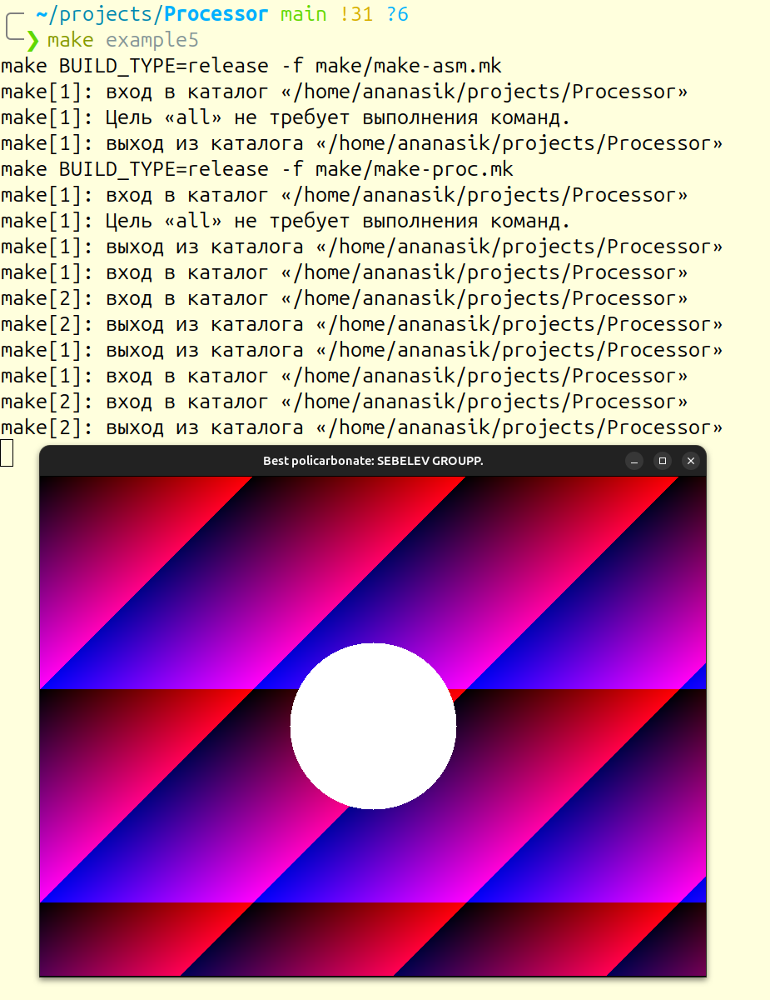
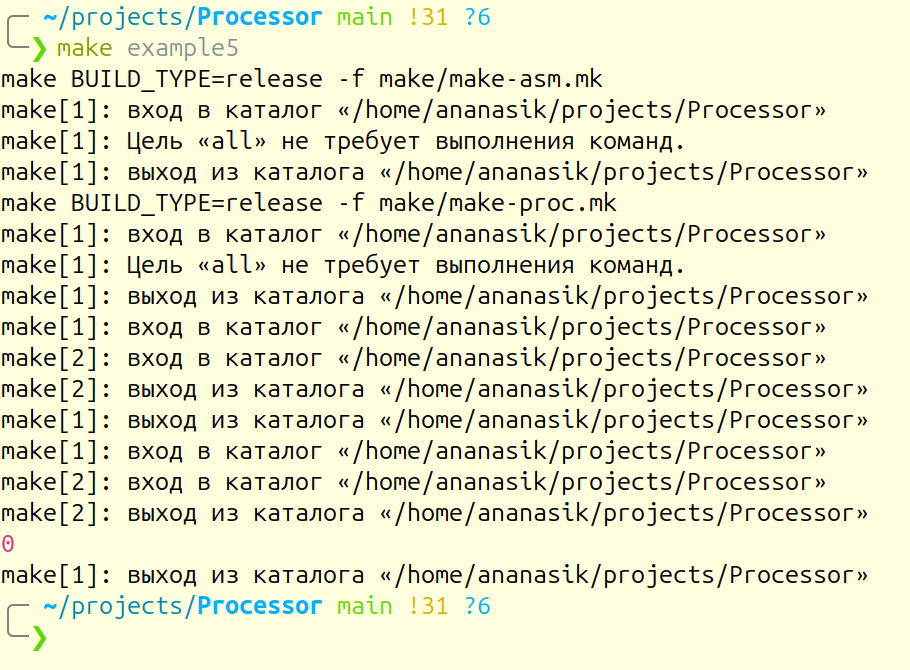

# Примеры

Если вы хотите посмотреть как работают примеры, просто пропишите в консоли следующие команды для каждого примера соответственно:
```bash
make example1
```
```bash
make example2
```
```bash
make example3
```
```bash
make example4
```
```bash
make example5
```

Можете так же проделать это без использования `Makefile`:
```bash
./build/asm -s examples/example1/HelloWorld.asm -b examples/example1/HelloWorld.bin
./build/.exe -e examples/example1/HelloWorld.bin
```
```bash
./build/asm -s examples/example2/Math.asm -b examples/example2/Math.bin
./build/.exe -e examples/example2/Math.bin
```
```bash
./build/asm -s examples/example3/Cycle.asm -b examples/example3/Cycle.bin
./build/.exe -e examples/example3/Cycle.bin
```
```bash
./build/asm -s examples/example4/Factorial.asm -b examples/example4/Factorial.bin
./build/.exe -e examples/example4/Factorial.bin
```
```bash
./build/asm -s examples/example5/circle.asm -b examples/example5/circle.bin
./build/.exe -e examples/example5/circle.bin
```

# Ожидаемый результат

**Если вывод программы на вашем компьютере будет отличаться, то вероятно программа работает некоректно.**\
Вероятные причины:\
-несовместимость с вашим устройствой и/или ОС.\
-изменение исходных файлов (попробуйте переустановить программу).

## example1


**вывод в консоль**:
```bash
Hello, World!
Hello, World!
```
<br>

## example2


**вывод в консоль:**
```bash
5
```
<br>

## example3


**вывод в консоль:**
```bash
0 1 2 3 4 5 6 7 8 9 10 
10 9 8 7 6 5 4 3 2 1 0
```
<br>


## example4


**вывод в консоль:**
```bash
Programm out: 5040
```
<br>


## example5
**Создастся окно размером 600x800 и будет выведена картинка:**



**После нажатия на `Space` окно закроется и в консоль будет выведен `0`, как знак успешного завершения программы.**



**вывод в консоль:**
```bash
0
```
