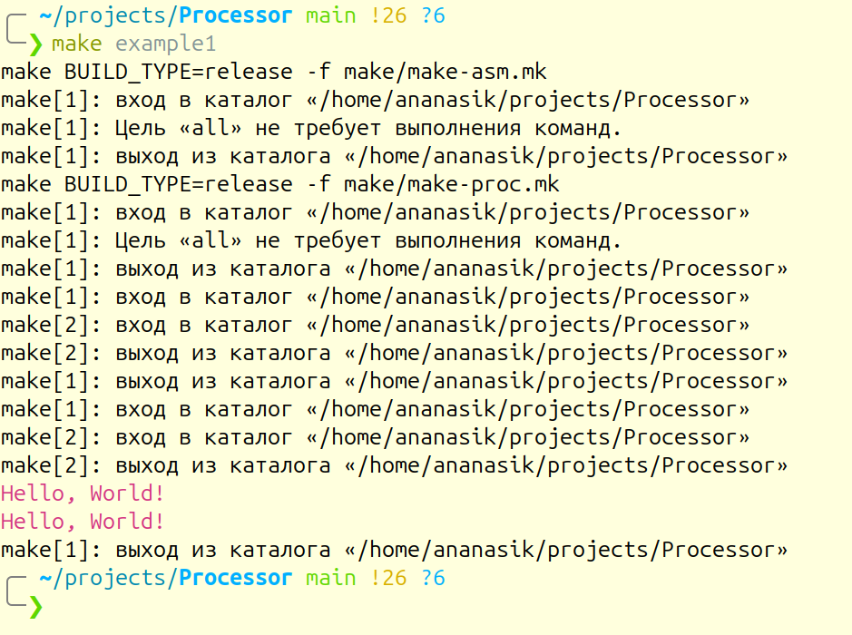
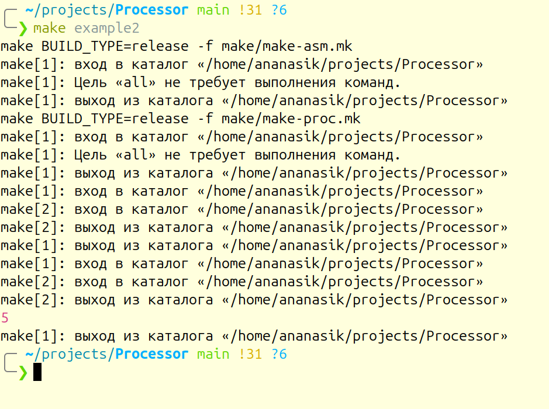
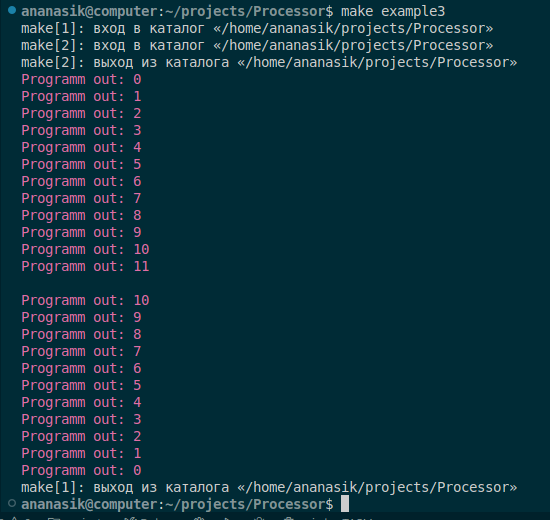
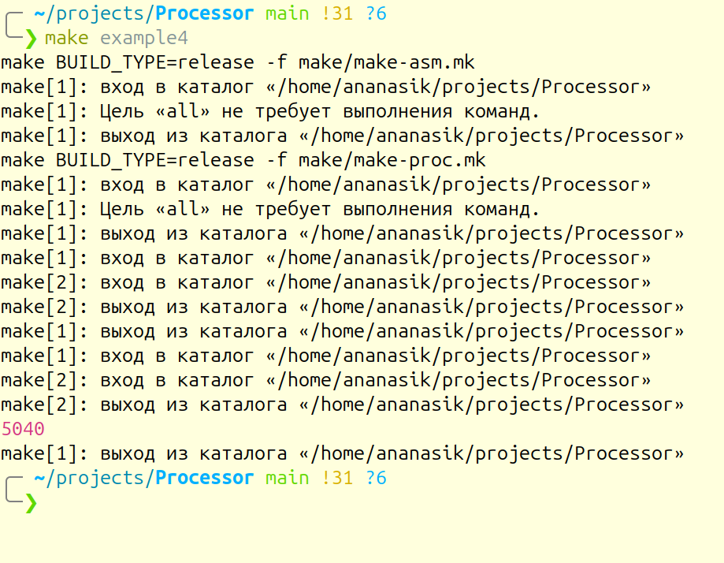
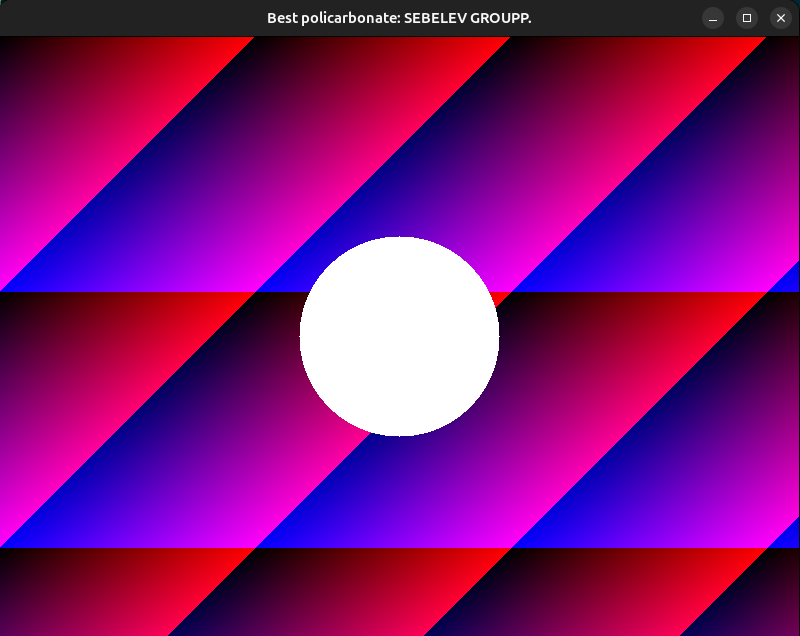

# Примеры

Если вы хотите посмотреть как работают примеры, просто пропишите в консоли следующие команды для каждого примера соответственно:
```bash
make example1
```
```bash
make example2
```
```bash
make example3
```
```bash
make example4
```
```bash
make example5
```

Можете так же проделать это без использования `Makefile`:
```bash
./build/processor -compile examples/example1/HelloWorld.asm examples/example1/HelloWorld.bin -run examples/example1/HelloWorld.bin 
```
```bash
./build/processor -compile examples/example2/Math.asm examples/example2/Math.bin -run examples/example2/Math.bin 
```
```bash
./build/processor -compile examples/example3/Cycle.asm examples/example3/Cycle.bin -run examples/example3/Cycle.bin 
```
```bash
./build/processor -compile examples/example4/Factorial.asm examples/example4/Factorial.bin -run examples/example4/Factorial.bin 
```
```bash
./build/processor -compile examples/example5/circle.asm examples/example5/circle.bin -run examples/example5/circle.bin 
```

# Ожидаемый результат

**Если вывод программы на вашем компьютере будет отличаться, то вероятно программа работает некоректно.**\
Вероятные причины:\
-несовместимость с вашим устройствой и/или ОС.\
-изменение исходных файлов (попробуйте переустановить программу).\

## example1


**вывод в консоль**:
```bash
Hellow, World!
```
<br>

## example2


**вывод в консоль:**
```bash
Programm out: 5
```
<br>

## example3


**вывод в консоль:**
```bash
Programm out: 0
Programm out: 1
Programm out: 2
Programm out: 3
Programm out: 4
Programm out: 5
Programm out: 6
Programm out: 7
Programm out: 8
Programm out: 9
Programm out: 10
Programm out: 11

Programm out: 10
Programm out: 9
Programm out: 8
Programm out: 7
Programm out: 6
Programm out: 5
Programm out: 4
Programm out: 3
Programm out: 2
Programm out: 1
Programm out: 0
```
<br>


## example4


**вывод в консоль:**
```bash
Programm out: 5040
```
<br>


## example5
**Создастся окно размером 600x800 и будет выведена картинка:**


